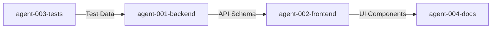

# Multi-Agent Coordination Board

Use this file for cross-agent communication, planning, and decision-making.

## Active Discussions

### [TIMESTAMP] - [AGENT-ID] - [Topic]
**Status**: [Open | Resolved]
**Question/Proposal**: [What needs to be discussed]
**Affects**: [Which agents/components]

**Responses**:
- [AGENT-ID] [TIMESTAMP]: [Response]
- [AGENT-ID] [TIMESTAMP]: [Response]

**Resolution**: [Final decision if resolved]

---

## Architecture Decisions

### Decision Log
| Date | Decision | Made By | Affected Agents | Status |
|------|----------|---------|-----------------|--------|
| [DATE] | [What was decided] | [AGENT-ID] | [agent-001, agent-002] | [Implemented] |

---

## Scheduled Coordination

### Planned Integration Points
| When | What | Agents Involved | Status |
|------|------|-----------------|--------|
| [DATE/TIME] | [Integration task] | [agent-001, agent-002] | [Pending] |

---

## Inter-Agent Dependencies

---

## Announcements

### [TIMESTAMP] - [AGENT-ID]
[Important announcement all agents should know]

---

## Guidelines
- Tag relevant agents with @agent-XXX
- Update status when discussions are resolved
- Keep discussions focused and actionable
- Move implementation details to individual agent logs
### 2025-07-24 13:15:31 - agent-950-core-implementation
New agent initialized for: core-implementation
